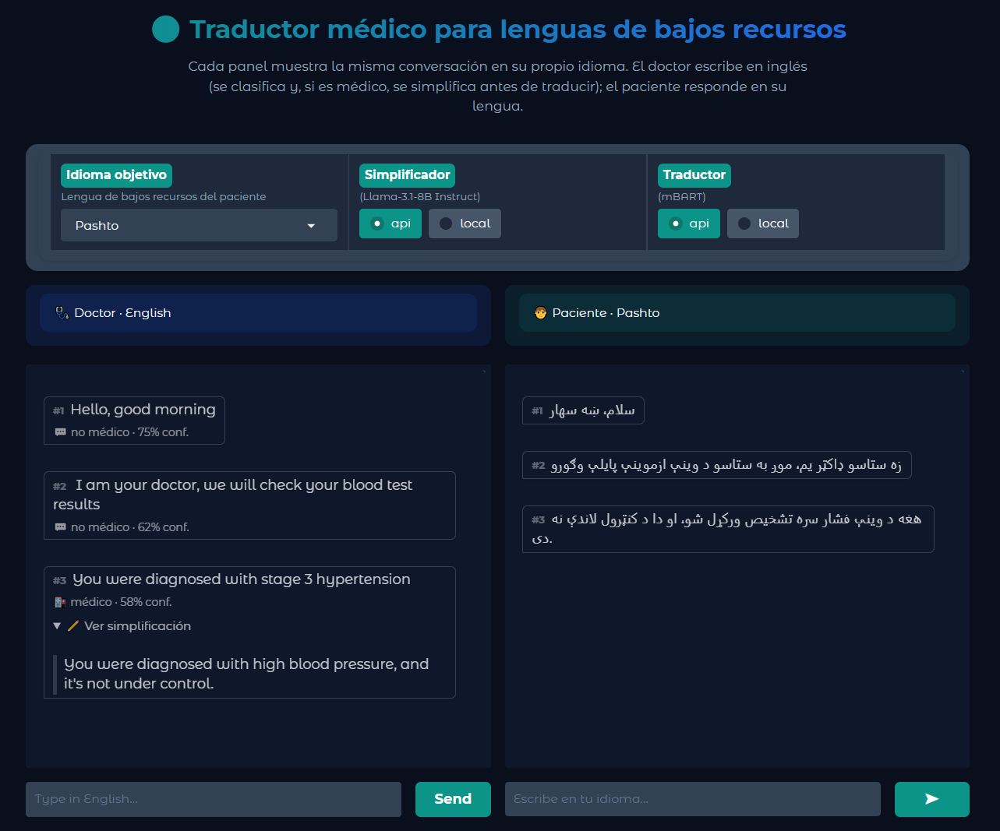
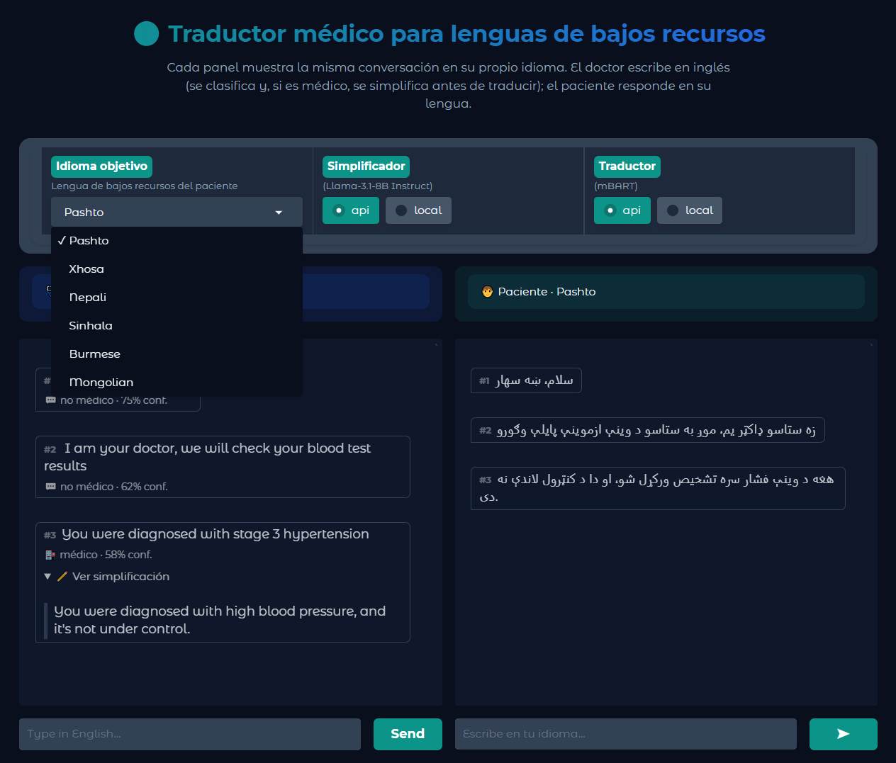

# Traducción Automática de Lenguas de Bajos Recursos
**Máster Universitario en Lógica, Computación e Inteligencia Artificial (MULCIA)**  
Procesamiento del Lenguaje Natural · Curso 2025–26

> Herramienta de traducción automática en el ámbito médico para Médicos Sin Fronteras,
> con detección y simplificación de terminología médica previa a la traducción.
> El doctor escribe en inglés (lengua de altos recursos) y el paciente recibe el
> mensaje en su lengua de bajos recursos, simplificado si el mensaje es 
> catalogado de caracter médico. En sentido inverso, la respuesta del
> paciente se traduce de vuelta al inglés, sin ser simplificada en ningún caso.

---

## Arquitectura del sistema

El sistema es un **pipeline direccional**: el tratamiento de cada turno depende de
quién habla.

```
Doctor (en_XX)  ──►  [C2 clasificar]  ──►  [C3 simplificar si es médico]  ──►  [C4 traducir]  ──►  Paciente (xx_XX)
Paciente (xx_XX)   ──────────────────────────────────────────────────────────►  [C4 traducir]  ──►  Doctor (en_XX)
```

Siendo *xx_XX* el código de lenguaje asignado por el modelo de traducción al idioma de bajos recursos objetivo.

La clasificación (C2) y la simplificación (C3) **solo se aplican en el sentido
inglés → lengua de bajos recursos**, porque solo el doctor produce terminología
médica que conviene simplificar antes de traducir. En sentido inverso la traducción
es directa.

### C1 · Captación y transcripción de voz a texto (STT)
*No implementado en este prototipo.* La interfaz actual es de texto, la captación de
voz queda como trabajo futuro (la entrada del doctor/paciente sería transcrita aquí
antes de entrar en C2/C4).

### C2 · Detección de contexto médico (TF-IDF + SVM)

Clasificador binario que determina si una frase contiene terminología médica. Solo se
activa en la dirección inglés → lengua de bajos recursos.

- **Entrenamiento:** [`modules/medical_detector.py`](modules/medical_detector.py) -
  descarga los datasets, equilibra las clases, entrena y guarda el modelo.
- **Inferencia (utilizada por el pipeline):** [`modules/detector.py`](modules/detector.py) -
  carga el `.pkl` y expone `classify()`.

**Datasets utilizados** (equilibrados por clase, `n = min(médico, cotidiano)`):
- [avaliev/chat_doctor](https://huggingface.co/datasets/avaliev/chat_doctor): conversaciones reales médico-paciente. Clase positiva (médico = 1).
- [agentlans/li2017dailydialog](https://huggingface.co/datasets/agentlans/li2017dailydialog): diálogos cotidianos. Clase negativa (no médico = 0).

**Modelo:** Pipeline de scikit-learn con `TfidfVectorizer` (10.000 features,
unigramas y bigramas) + `LinearSVC` (`class_weight="balanced"`).

**Resultados:**
| Métrica | Valor |
|---------|-------|
| Accuracy | 0.9969 |
| Macro-Precision | 0.9969 |
| Macro-Recall | 0.9969 |
| F1-Macro | 0.9969 |

La función pública `classify(text)` devuelve `(is_medical, confidence)`. La confianza
se aproxima aplicando una sigmoide al margen de `decision_function` (orientativa, no
calibrada):

```python
from detector import classify

classify("Doctor, I have chest pain and difficulty breathing.")  # → (True,  0.99)
classify("What are you doing this weekend?")                     # → (False, 0.97)
```

Para (re)entrenar el modelo: `python medical_detector.py` (descarga ambos datasets).

### C3 · Simplificación de lenguaje médico (Llama-3.1-8B-Instruct)

Reformula una frase en inglés con tecnicismos médicos a lenguaje llano que un paciente
pueda entender, **preservando el significado y todas las negaciones** (`no`, `not`,
`without`) y manteniendo números, dosis y unidades.
Ejemplo: *"edema" → "swelling caused by fluid"*.

- **Módulo:** [`modules/simplifier.py`](modules/simplifier.py)
- **Modelo:** `meta-llama/Llama-3.1-8B-Instruct` (gated: requiere aceptar su licencia
  con la cuenta del token de Hugging Face).
- **Backends** (parámetro `mode`):
  - `"api"` - Hugging Face Inference API (chat completion). Requiere `HF_TOKEN`.
  - `"local"` - el modelo descargado y ejecutado en CPU.

Solo se invoca en el sentido altos → bajos recursos y únicamente cuando C2 detecta
terminología médica.

### C4 · Traducción multilingüe (mBART-50)

- **Módulo:** [`modules/translator.py`](modules/translator.py)
- **Modelo:** `facebook/mbart-large-50-many-to-many-mmt` (~2.4 GB, la primera ejecución en local lo descarga y luego funciona offline).
- **Backends** (parámetro `mode`):
  - `"local"` - ejecución local en CPU/GPU. **Camino fiable.**
  - `"api"` - Hugging Face Inference API. Ojo: el router serverless no siempre
    respeta `src_lang`/`tgt_lang` para mBART, por lo que conviene validar sus salidas.

**Lengua de altos recursos:** inglés (`en_XX`).
**Lenguas de bajos recursos ofrecidas en la interfaz:** Pashto (`ps_AF`), Xhosa
(`xh_ZA`), Nepali (`ne_NP`), Sinhala (`si_LK`), Burmese (`my_MM`), Mongolian
(`mn_MN`). Se pueden añadir más editando `LOW_RESOURCE_LANGS` en `translator.py`
(cualquier código soportado por mBART-50).

### C5 · Síntesis de voz (TTS)
*No implementado en este prototipo.* Convertiría la traducción de salida en audio, queda como trabajo futuro junto con C1.

---

## Instalación, uso y despliegue

### Requisitos
- Python 3.10+ (probado en 3.13).
- Una cuenta y token de Hugging Face.

### 1. Instalación

```bash
git clone https://github.com/nataliaaolmo/Traduccion-automatica-lenguas-bajos-recursos.git
cd traduccion-bajos-recursos
python -3.10 -m venv .venv

# Windows (PowerShell)
.venv\Scripts\Activate.ps1
# Linux/Mac
source .venv/bin/activate

pip install -r requirements.txt
```

### 2. Configuración del token (.env)

Los backends `"api"` y la descarga del modelo gated de Llama necesitan un token de
Hugging Face. Crea un archivo `.env` **dentro de `modules/`** (lo carga
automáticamente [`modules/env.py`](modules/env.py), está ignorado por git), usar .env.example como plantilla y renombrarlo al configurar el token:

```
HF_TOKEN=YOUR_HUGGINGFACE_TOKEN_HERE
```

Si no defines token, usa los modos `"local"` (Es posible que los modelos requieran aceptar los términos en su correspondiente página de Hugging Face).

### 3. Ejecutar la aplicación web

La interfaz es una app de **Gradio**. Se lanza desde dentro de `modules/`:

```bash
cd modules
python app.py
```

Gradio abre una URL local (`http://127.0.0.1:7860`). La interfaz muestra dos paneles
bilingües: doctor (inglés) y paciente (lengua elegida)- con selección de idioma y de
backend (`api`/`local`) para el simplificador y el traductor por separado.

#### Vista de la interfaz web

Vista principal de la aplicación, con los paneles del doctor y del paciente:



Selector de la lengua de bajos recursos de destino:




### 4. Probar los componentes por separado

Cada módulo es ejecutable de forma independiente para depuración:

```bash
cd modules
python medical_detector.py   # C2: (re)entrena el clasificador y lanza tests
python detector.py           # C2: inferencia sobre frases de ejemplo
python translator.py         # C4: traduce una frase a varios idiomas
python simplifier.py         # C3: simplifica frases médicas (SIMPLIFY_MODE=api|local)
python pipeline.py           # Orquestador: demo de las dos direcciones
```

> **Nota de rendimiento:** los modelos en modo `"local"` se cargan de forma perezosa
> (la primera traducción/simplificación es lenta, las siguientes reutilizan el modelo
> en memoria). <br> **Recomendado**: utilizar ambos modelos en modo api siempre que sea posible.

---

## Estructura del repositorio
```
├── modules/
│   ├── app.py                # Interfaz web Gradio (entrypoint)
│   ├── pipeline.py           # Orquestador del pipeline direccional
│   ├── detector.py           # C2: inferencia del detector médico (classify)
│   ├── medical_detector.py   # C2: entrenamiento del detector (TF-IDF + SVM)
│   ├── simplifier.py         # C3: simplificación de lenguaje médico (Llama)
│   ├── translator.py         # C4: traducción multilingüe (mBART-50)
│   ├── env.py                # Carga de .env (HF_TOKEN)
│   └── models/
│       └── medical_detector.pkl   # Modelo entrenado de C2
├── requirements.txt          # Dependencias
├── .gitignore
└── README.md
```

### Dependencias principales
`datasets`, `scikit-learn`, `joblib` (C2) · `transformers`, `torch`, `sentencepiece`
(C3/C4) · `huggingface_hub` (backends api) · `python-dotenv` (.env) · `gradio` (UI).
Versiones exactas en [`requirements.txt`](requirements.txt).

## Autores

- Mario Vázquez Lechuga
- Cristian Caballero Sánchez
- Natalia Olmo Villegas
- Manuel Enciso Martínez

---
